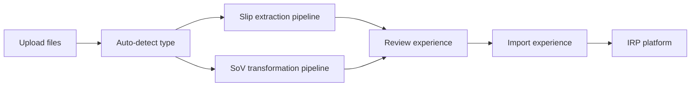

# Architecture Notes

## Core flow

## Major capabilities

- Intelligent file-type detection and auto-routing across Slip Stream and SoV Stream.
- No Slips/SOVs license split — an RDR-licensed user can process slips, SoVs, or both; usage and access are governed by metering, quota, and group-based data access (not a per-type license gate).
- Groups-based data security, with each upload treated as a securable platform resource.
- Workflow service integration for long-running async processing.
- Quota enforcement through the platform quota service.
- Telemetry for UI usage, API metrics, errors, endpoints, users, and tenants.

## Slip Stream

- Extracts and normalizes policy slips.
- Supports review and validation of extracted fields.
- Captures feedback for downstream improvement.
- Produces IRP Exposure-aligned structured output.

## SoV Stream

- Cleanses raw SOV input.
- Performs address parsing and geocoding through IRP APIs.
- Converts descriptive exposure fields into standardized model-ready codes.
- Allows module-level re-run without re-uploading the original file.

## Storage and quota guardrails

- Submission flow: original docs -> S3 (raw) -> Postgres (metadata) -> AI processing (slips + SoVs as one bundle per account) -> S3 (refined outputs) -> EDM import.
- Usage-priced (per account, per 1k locations), so volume and concurrency are pricing levers, not caps.
- Intentional guardrails (all elastic/adjustable): 100 MB on submission data at ingress, and a max-concurrency guardrail for EDM import (proposed 10 concurrent, 100/day). Processing slips + SoVs into an account has no concurrency limit.
- Detail and tables: [[Pricing Packaging and Quota]].

## Deferred or phase-two items

- Embedded agents inside UIQ, Risk Modeler, and ExposureIQ are phase two.
- New data types beyond slips and SOVs are deferred.
- Dashboard redesign and API content reshaping are intentionally non-goals for July GA.

## Source references

- `/Users/cherlopb/IdeaProjects/catmosai-sales-pitch/July GA Scope/risk-data-refinery-ga-scope-summary.md`
- `/Users/cherlopb/IdeaProjects/catmosai-sales-pitch/July GA Scope/risk-data-refinery-ga-scope.md`
- `/Users/cherlopb/IdeaProjects/catmosai-sales-pitch/slipstream-preview/README.md`
