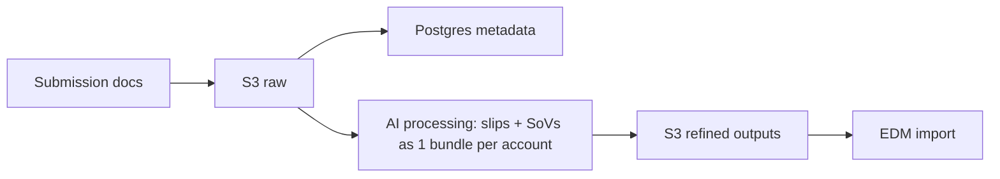

# Pricing, Packaging and Quota

Durable summary of the RDR pricing/packaging model and the system limits/quotas. Built to answer a leadership question: "what are the limits across all dimensions — input storage, concurrent users across locations/accounts, how each size delivers, jobs/day, etc.?"

## Pricing model (for evaluation at GA)

- Consumption-with-commitment model. Two value metrics:
  - **Accounts** (slips & SoVs) — list rate **$50 / account**.
  - **Locations** (SoVs) — list rate **$35 / 1,000 locations**.
- Volume-based discount waterfalls (steeper discount as committed volume grows). Sales empowered to discount above recommended levels; framework to be re-evaluated at rollout.
- Source: *Risk Data Refinery — May 26 — Pricing and Packaging Design* (PDF in source project root).

### Discount waterfalls (summary, list -> discounted)

- Accounts: <500 = $25k (0% disc) climbing to 100k+ = $1,579k (84% implied discount); price/account falls $50 -> $8; gross margin 91% -> 70%.
- Locations: <1M = $35k (0% disc) climbing to 80M+ = $1,176k (79% implied discount); price/1k falls $35 -> $7; gross margin 94% -> 88%.
- Full per-band tables live in the source project (see below).

## System quotas and limits

RDR is usage-priced, so volume and concurrency are pricing levers, not caps. There are only two intentional guardrails (ingress + EDM import).

| Dimension | Limit | Type |
| --- | --- | --- |
| Submission file size | 100 MB per submission (adjustable) | Guardrail (system protection) |
| Input/output storage (S3) | No fixed cap | No limit (usage-based) |
| Data retention (submission files + processed data) | 2 years (proposed); then archival or Data Vault (TBD) | Guardrail + upsell (Data Vault upsell opportunity) |
| Metadata store (Postgres) | No fixed cap | No limit (usage-based) |
| Accounts processed | No limit | Priced per account |
| Locations processed | No limit | Priced per 1k locations |
| Concurrent submission jobs (slips + SoVs -> account) | No concurrency limit | No limit |
| Non-submission jobs / day | 100 / day (proposed) | Guardrail (proposed) |
| Concurrent non-submission jobs (EDM import) | 10 concurrent (proposed) | Guardrail (proposed); protects SQL server + platform-wide downstream functions |
Notes on the non-submission job guardrails:
- Phase 1 non-submission jobs = EDM import only; expandable to other job types (ERD, LI loss-cost interpretation, etc.) from preview feedback.
- Per-day max (100) is a daily volume / fair-use allowance that can be raised over time; the concurrency cap (10, a stretch above Analytical Services observed numbers) is the real-time system-protection guardrail.
- Submission processing (slips + SoVs into an account) stays unlimited; guardrails apply only to non-submission jobs.

## Data flow and guardrails

- S3 per-submission guardrail: 100 MB on submission data; can be elastic (adjustable as real use cases are observed).
- Submission processing: no concurrency limit — slips and SoVs processed together as one bundle into an account.
- EDM import guardrail (non-submission jobs): proposed 10 concurrent and 100 / day to protect the SQL server and other platform-wide downstream functions during import of processed data; Phase 1 = EDM import, expandable to ERD, LI loss-cost interpretation, etc.

## Source references

- `/Users/cherlopb/IdeaProjects/catmosai-sales-pitch/pricing-packaging-quota/index.html` — themed leadership tabular view.
- `/Users/cherlopb/IdeaProjects/catmosai-sales-pitch/pricing-packaging-quota/pricing-packaging-quota.md` — markdown source with full per-band tables.
- `/Users/cherlopb/IdeaProjects/catmosai-sales-pitch/Risk Data Refinery - May 26  - Pricing and Packaging Design.pdf` — pricing/packaging source.
- `/Users/cherlopb/IdeaProjects/catmosai-sales-pitch/pricing-packaging-quota/margin-analysis.md` (+ `margin-*.csv`) — marginal cost-to-profit framework; see [[Margin Analysis]].

## Related

- [[RDR Metering Quota and Storage]] — newer, more detailed metering/telemetry/storage spec (differs: 5 concurrent non-submission jobs, 365-day deletion without platform storage).
- [[Architecture Notes]]
- [[Margin Analysis]]
- [[Open Questions]]
